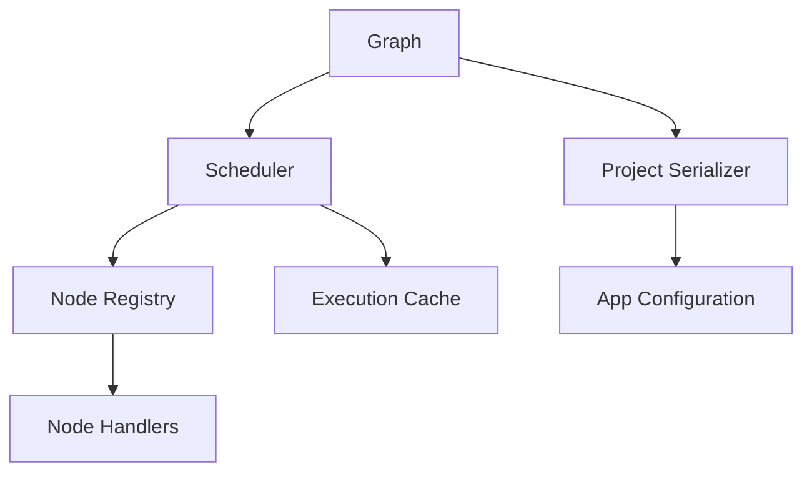

# Python Runtime Architecture

## Overview
The Python migration introduces a modular package layout that separates runtime concerns from user interface code. The `hesiod_py` package contains core graph types, execution utilities, IO adapters, and node definitions. Supporting documentation and CI ensure the codebase remains portable across Windows and Linux.

## Package Layout
```text
hesiod_py/
  core/        # Graph model, scheduler, configuration, runtime registry
  nodes/       # Primitive and domain-specific node implementations
  io/          # Importers, exporters, serialization utilities
  ui/          # Placeholder for future PySide-based UI components
  plugins/     # Optional extension modules discovered at runtime
  data/        # Shared data structures for heightmaps and meshes
```

## Runtime Components


- **Graph** holds nodes, directed connections, and dirty state tracking for incremental recompute.
- **Scheduler** evaluates nodes in topological order, consulting the execution cache for memoised results.
- **Node Registry** is a pluggable lookup for handler callables; `register_primitives` seeds the MVP set.
- **Execution Cache** fingerprints node inputs and parameters to skip recomputation when nothing changed.
- **Project Serializer** converts between on-disk JSON and in-memory runtime structures.
- **App Configuration** centralises runtime paths, performance switches, and metadata.

## Configuration and Logging
Configuration is stored as JSON documents validated through `pydantic` models. Logging is standardised via `loguru`, writing to stdout and optional file sinks.

## Extensibility
- Plugins can register additional node handlers at bootstrap time using the shared registry.
- IO adapters translate between legacy `.hsd` payloads and the Python graph representation, reporting unsupported constructs.
- Heightmap and mesh abstractions are numpy-backed, ready for CPU or GPU acceleration layers in future phases.
