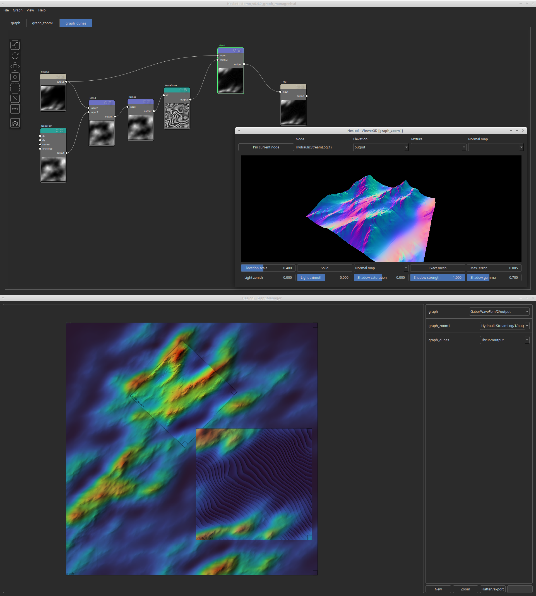

# Welcome to Hesiod



Hesiod is an open-source application designed for generating procedural terrains using a node-based interface. This tool allows user to create detailed and realistic landscapes by connecting nodes that control various terrain elements such as elevation, erosion, filters to develop complex terrain models.

> [!WARNING]
> As an actively developed open-source project, Hesiod is continuously evolving, with new features being added and existing ones improved. This ongoing development may lead to instabilities, as updates and changes are integrated. Please use the issue and discussion [threads](https://github.com/otto-link/Hesiod/issues) to help us make this software better.

## Download and installation

Standalone executables for Windows and Linux are available on [sourceforge.net/projects/hesiod](https://sourceforge.net/projects/hesiod).

- For Windows user: unzip the archive and execute `hesiod.exe`.
- For Linux user: make the AppImage executable with the command line `chmod a+x hesiod.AppImage` or enable something like `Allow executing file as program` in your file explorer.

Batch mode execution allows headless computation of the graph nodes and modification of the main parameters:

```
bin/./hesiod --batch graph_made_with_the_gui.hsd --shape=1024,1024 --tiling=1,1 --overlap=0
```

## For users

A stub of user manual in under construction [here](user_manual/index.md).

## For developpers

As an open-source tool, hosted on [github.com/otto-link/Hesiod](https://github.com/otto-link/Hesiod), Hesiod greatly encourages contributions. Developers and enthusiasts are welcome to improve existing features, add new capabilities, or fix bugs, enhancing the tool's functionality and broadening its application scope.

## Workflow

Basic workflow generally follows the following steps:

**Generate Base Heightmap**

  - Users start by creating a base heightmap using primitives like coherent noises such as Perlin, OpenSimplex...
  - Fractal layering are available to add complexity and detail to the heightmap.
  - Multiple layers of noise can be blended together to achieve the desired terrain features.

**Apply Physical Erosion Processes**

  - After generating the base heightmap, users can apply physical erosion processes to simulate natural erosion phenomena such as rivers, valleys, and sediment deposition.
  - Erosion algorithms like thermal, hydraulic, and sediment transport erosion can be utilized to sculpt the terrain realistically.

**Texture Mapping**

  - Once the terrain shape is finalized, users can proceed to texture mapping.
  - Predefined colormaps are available to assign textures based on elevation, slope, or other user-defined parameters.
  - Selection nodes allow users to define masks for precise texture placement, enabling detailed texturing of specific areas of the terrain.

**Iterative Refinement**

  - Throughout the workflow, users can iteratively refine the terrain by adjusting parameters and experimenting with different procedural elements.
  - Real-time rendering provides instant feedback, allowing users to visualize the effects of their modifications and make adjustments accordingly.

**Export**

  - Upon completion, the generated terrain can be exported in various formats compatible with 3D modeling software or game engines.
  - This allows users to seamlessly integrate the procedurally generated terrain into their digital projects for further development and visualization.

**Batch Export with Headless Computation**

  - Hesiod supports batch export, allowing users to compute the graph nodes on a finer resolution without the need for manual intervention.

## FAQ

Frequently Asked Questions are found [here](faq/index.md).