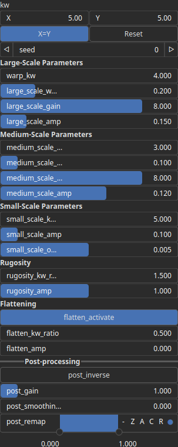

BasaltField Node
================

No description available

# Category

Primitive/Geological
# Inputs

|Name|Type|Description|
| :--- | :--- | :--- |
|dx|Heightmap|Displacement with respect to the domain size (x-direction).|
|dy|Heightmap|Displacement with respect to the domain size (y-direction).|
|envelope|Heightmap|Output noise amplitude envelope.|

# Outputs

|Name|Type|Description|
| :--- | :--- | :--- |
|out|Heightmap|The generated heightmap from brush strokes.|

# Parameters

|Name|Type|Description|
| :--- | :--- | :--- |
|flatten_activate|Bool|No description|
|flatten_amp|Float|No description|
|flatten_kw_ratio|Float|No description|
|kw|Wavenumber|Noise wavenumbers (kx, ky) for each directions.|
|large_scale_amp|Float|No description|
|large_scale_gain|Float|No description|
|large_scale_warp_amp|Float|No description|
|medium_scale_amp|Float|No description|
|medium_scale_gain|Float|No description|
|medium_scale_kw_ratio|Float|No description|
|medium_scale_warp_amp|Float|No description|
|post_gain|Float|Set the gain. Gain is a power law transformation altering the distribution of signal values, compressing or expanding certain regions of the signal depending on the exponent of the power law.|
|post_inverse|Bool|Inverts the output values after processing, flipping low and high values across the midrange.|
|post_remap|Value range|Linearly remaps the output values to a specified target range (default is [0, 1]).|
|post_smoothing_radius|Float|Defines the radius for post-processing smoothing, determining the size of the neighborhood used to average local values and reduce high-frequency detail. A radius of 0 disables smoothing.|
|rugosity_amp|Float|No description|
|rugosity_kw_ratio|Float|No description|
|seed|Random seed number|Random seed number.|
|small_scale_amp|Float|No description|
|small_scale_kw_ratio|Float|No description|
|small_scale_overlay_amp|Float|No description|
|warp_kw|Float|No description|

# Example

No example available.