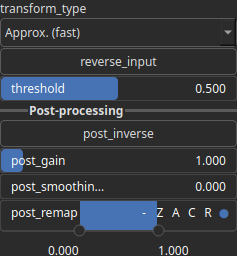

DistanceTransform Node
======================

Generates a distance map where each pixel's value represents the shortest distance to the nearest non-zero value in the input heightmap.

# Category

Operator/Morphology
# Inputs

|Name|Type|Description|
| :--- | :--- | :--- |
|input|Heightmap|Input heightmap used to compute the distance transform.|

# Outputs

|Name|Type|Description|
| :--- | :--- | :--- |
|output|Heightmap|Generated distance map based on the input heightmap.|

# Parameters

|Name|Type|Description|
| :--- | :--- | :--- |
|post_gain|Float|Set the gain. Gain is a power law transformation altering the distribution of signal values, compressing or expanding certain regions of the signal depending on the exponent of the power law.|
|post_inverse|Bool|Inverts the output values after processing, flipping low and high values across the midrange.|
|post_remap|Value range|Linearly remaps the output values to a specified target range (default is [0, 1]).|
|post_smoothing_radius|Float|Defines the radius for post-processing smoothing, determining the size of the neighborhood used to average local values and reduce high-frequency detail. A radius of 0 disables smoothing.|
|reverse_input|Bool|Invert the input values before processing.|
|threshold|Float|Defines the cutoff value for considering non-zero input pixels.|
|transform_type|Enumeration|Specifies the distance metric used for transformation (e.g., Euclidean, Manhattan, or Chessboard distance).|

# Example

No example available.