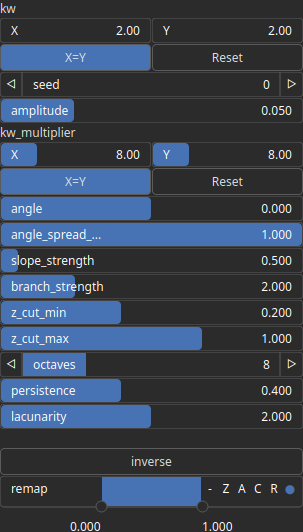

Gavoronoise Node
================

Generates a 2D heightmap using the GavoroNoise algorithm, a procedural noise technique for terrain generation.

# Category

Primitive/Coherent
# Inputs

|Name|Type|Description|
| :--- | :--- | :--- |
|angle|Heightmap|Optional input for dynamically modifying the wavelet orientation per pixel.|
|control|Heightmap|Optional input that modulates noise intensity or distribution.|
|dx|Heightmap|Optional input for perturbing noise in the X-direction.|
|dy|Heightmap|Optional input for perturbing noise in the Y-direction.|
|envelope|Heightmap|Modulates the amplitude of the noise across the heightmap.|

# Outputs

|Name|Type|Description|
| :--- | :--- | :--- |
|output|Heightmap|The final heightmap generated using the GavoroNoise algorithm.|

# Parameters

|Name|Type|Description|
| :--- | :--- | :--- |
|amplitude|Float|Controls the overall intensity of the noise function.|
|angle|Float|Sets the primary orientation of the wave structures in the noise.|
|angle_spread_ratio|Float|Determines the degree of variation in the angle of the wave structures. Lower values create more aligned structures.|
|branch_strength|Float|Controls the prominence of branch-like features in the generated noise.|
|inverse|Bool|Invert the output values of the noise function.|
|kw|Wavenumber|Wave number vector that determines the base frequency of the noise.|
|kw_multiplier|Wavenumber|Multiplier applied to the wave numbers, affecting the frequency scaling of the noise function.|
|lacunarity|Float|Controls the frequency scaling between successive octaves in the fractal noise function. Higher values create larger gaps between frequencies.|
|octaves|Integer|Number of noise layers (octaves) used in fractal Brownian motion (fBm). More octaves add finer details.|
|persistence|Float|Determines how much each successive octave contributes to the final noise pattern. Higher values amplify finer details.|
|remap|Value range|Remap the noise output values to a specified range, defaulting to [0, 1].|
|seed|Random seed number|Sets the random seed for reproducible noise generation.|
|slope_strength|Float|Controls the strength of slope-based directional erosion in the noise function.|
|z_cut_max|Float|Defines the maximum cutoff value for the Z-axis in the generated noise.|
|z_cut_min|Float|Defines the minimum cutoff value for the Z-axis in the generated noise.|

# Example

No example available.