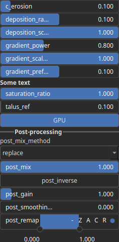

HydraulicStreamLog Node
=======================

HydraulicStream is an hydraulic erosion operator using the flow stream approach and an infinite flow direction algorithm for simulating the erosion processes. Simulate water flow across the terrain using the infinite flow direction algorithm. As water flows over the terrain, flow accumulation representing the volume of water that passes through each point on the map, is computed to evaluate the erosive power of the water flow. Deposition is mimicked using convolution filters.

# Category

Erosion/Hydraulic
# Inputs

|Name|Type|Description|
| :--- | :--- | :--- |
|input|Heightmap|TODO|
|mask|Heightmap|Mask defining the filtering intensity (expected in [0, 1]).|

# Outputs

|Name|Type|Description|
| :--- | :--- | :--- |
|deposition|Heightmap|Deposition map (in [0, 1]).|
|erosion|Heightmap|Erosion map (in [0, 1]).|
|flow_map|Heightmap|TODO|
|output|Heightmap|TODO|

# Parameters

|Name|Type|Description|
| :--- | :--- | :--- |
|GPU|Bool|Toogle GPU acceleration on or off.|
|c_erosion|Float|Erosion intensity.|
|deposition_radius|Float|TODO|
|deposition_scale_ratio|Float|TODO|
|gradient_power|Float|TODO|
|gradient_prefilter_radius|Float|TODO|
|gradient_scaling_ratio|Float|TODO|
|post_gain|Float|Set the gain. Gain is a power law transformation altering the distribution of signal values, compressing or expanding certain regions of the signal depending on the exponent of the power law.|
|post_inverse|Bool|Inverts the output values after processing, flipping low and high values across the midrange.|
|post_mix|Float|Mixing factor for blending input and output values. A value of 0 uses only the input, 1 uses only the output, and intermediate values perform a linear interpolation.|
|post_mix_method|Enumeration|Method used to combine input and output values. Options include linear interpolation (default), min, max, smooth min, smooth max, add, and subtract.|
|post_remap|Value range|Linearly remaps the output values to a specified target range (default is [0, 1]).|
|post_smoothing_radius|Float|Defines the radius for post-processing smoothing, determining the size of the neighborhood used to average local values and reduce high-frequency detail. A radius of 0 disables smoothing.|
|saturation_ratio|Float|Flow accumulation clipping ratio.|
|talus_ref|Float|Reference talus, with small values of talus_ref  leading to thinner flow streams.|

# Example

No example available.