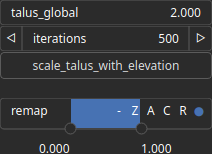

ThermalRidge Node
=================

Applies a thermal erosion effect that simulates the collapse of unstable slopes by moving material from steep areas to lower regions, generating ridged features.

# Category

Erosion/Thermal
# Inputs

|Name|Type|Description|
| :--- | :--- | :--- |
|input|Heightmap|The input heightmap to which thermal erosion will be applied.|
|mask|Heightmap|Mask defining the filtering intensity (expected in [0, 1]).|

# Outputs

|Name|Type|Description|
| :--- | :--- | :--- |
|deposition|Heightmap|Heightmap showing the amount of material deposited during erosion, scaled in the range [0, 1].|
|output|Heightmap|The resulting heightmap after thermal ridge erosion has been applied.|

# Parameters

|Name|Type|Description|
| :--- | :--- | :--- |
|iterations|Integer|Number of thermal erosion iterations to apply. More iterations result in more pronounced erosion and smoothing of steep slopes.|
|remap|Value range|Remap the operator's output to a specified range, defaulting to [0, 1].|
|scale_talus_with_elevation|Bool|Scales the talus threshold based on elevation, reducing it at lower heights and preserving it at higher altitudes, to simulate realistic slope behavior.|
|talus_global|Float|Global talus angle threshold controlling the maximum slope before material starts to move. Higher values result in steeper terrain preservation.|

# Example

