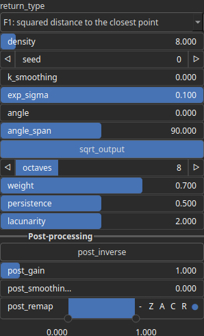

VorolinesFbm Node
=================

This function generates a Voronoi-like pattern based on the distance from each pixel to a set of randomly oriented lines. Each line is defined by a random point and a direction sampled from a uniform distribution around a given angle. Generates a fractal Voronoi pattern using fBm (fractal Brownian motion) based on distance fields and multiple noise layers.

# Category

Primitive/Coherent
# Inputs

|Name|Type|Description|
| :--- | :--- | :--- |
|dx|Heightmap|Displacement with respect to the domain size (x-direction).|
|dy|Heightmap|Displacement with respect to the domain size (y-direction).|
|envelope|Heightmap|No description|

# Outputs

|Name|Type|Description|
| :--- | :--- | :--- |
|out|Heightmap|No description|

# Parameters

|Name|Type|Description|
| :--- | :--- | :--- |
|angle|Float|No description|
|angle_span|Float|No description|
|density|Float|No description|
|exp_sigma|Float|No description|
|k_smoothing|Float|No description|
|lacunarity|Float|No description|
|octaves|Integer|No description|
|persistence|Float|No description|
|post_gain|Float|Set the gain. Gain is a power law transformation altering the distribution of signal values, compressing or expanding certain regions of the signal depending on the exponent of the power law.|
|post_inverse|Bool|Inverts the output values after processing, flipping low and high values across the midrange.|
|post_remap|Value range|Linearly remaps the output values to a specified target range (default is [0, 1]).|
|post_smoothing_radius|Float|Defines the radius for post-processing smoothing, determining the size of the neighborhood used to average local values and reduce high-frequency detail. A radius of 0 disables smoothing.|
|return_type|Enumeration|No description|
|seed|Random seed number|Random seed number.|
|sqrt_output|Bool|No description|
|weight|Float|No description|

# Example

No example available.